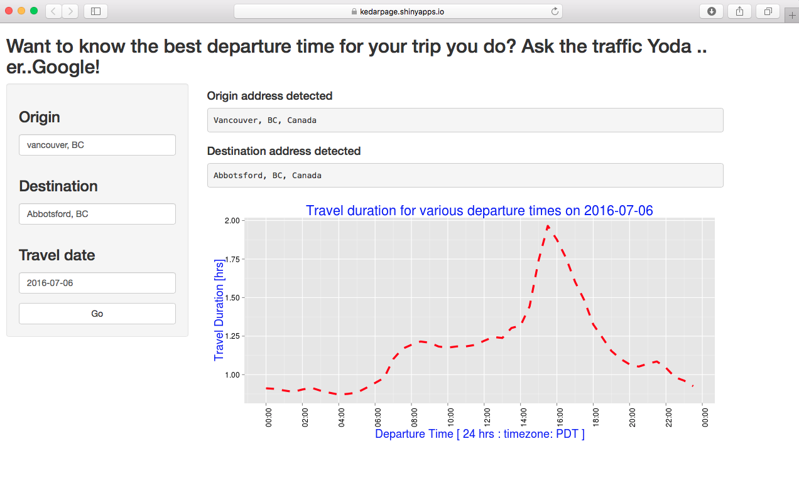

findbesttime - Shiny app
------------------------
Dec 10 2015

Are you going on a trip soon but don't know what is the best time to leave so you can miss the traffic? Don't base your decision on a gut feeling, I have an app for you!

[findbesttime](https://kedarpage.shinyapps.io/findbesttime) tells you how much time you will end up spending in the traffic for different departure times. You'll have to enter the *origin* and *destination* addresses and the date of travel and hit Go! The app will produce a plot of *duration in traffic vs departure times* spanning the whole 24 hours on the selected date in the timezone of the *origin*. Based on the plot, you can pick a *departure time* that saves time and works the best for you.

###How does it work? Here's how:

-   It geocodes both origin and destination addresses using google api. This is done by the function [geocode.R](https://github.com/STAT545-UBC/kedar_page/blob/master/Homework_11/geoCode.R).
-   Then it finds the timezone for the origin address using the geonames api. This is done inside [server.R](https://github.com/STAT545-UBC/kedar_page/blob/master/Homework_11/server.R).
-   It creates a list of departure times correspoending to every half hour starting at 00:00 (24 hrs) on the selected date. This is also done inside [server.R](https://github.com/STAT545-UBC/kedar_page/blob/master/Homework_11/server.R).
-   It then queries google maps database to find the travel times for all the departure times in the list. This is done by the function [gdistdur.R](https://github.com/STAT545-UBC/kedar_page/blob/master/Homework_11/gdistdur.R).
-   It then produces a plot of *travel duration vs departure times* which is shown on the screen. This is done inside [server.R](https://github.com/STAT545-UBC/kedar_page/blob/master/Homework_11/server.R).
-   Also shown on the screen are the *origin* and *destination* addresses that were used by Google to produce these estimates.

### Comments and tips

-   Try to specify **unambiguous addresses** for places. For example, if you typed "Vancouver" as one of the addresses when you mean "Vancouver, BC", the app will default to "Vancouver, WA" instead. So, try to be **as specific as possible**.
-   Only dates greater than today are allowed. This is because the app looks for travel duration for all of 24 hours of the selected date. It cannot look for travel times in the past. So **can only search future travel times**. For current travel time you can always use google maps!
-   The app has been tested for some unexpected inputs but not all. If for some unexpected input the server does not respond, please reload the app and try make your query less ambiguous and also make sure the selected date is a future date.
-   I use *Geonames* and *Google* apis for this, so thanks to both of them for letting me access their databases.
-   The Google api I use is rate limited. I make 48 queries for each request on my app and I am limited to 2500 queries per day, so a total ~50 requests can be submitted each day on this app. Try not use all of them :)
-   Hope you enjoy this app!!

### Reflections

-   It took quite some time to get this to work for a relativly simple looking app. It was a little hard to grasp how to use variables to pass data between different elements in the server.R file.
-   The app is slower than I expected since there is not much computation that is being done behind the scenes. I would like to find out ways to make it faster.
-   I realized that I can build some nice looking apps using JS/HTML/CSS with better functionality (for the future). I would like to make this app look nicer.
-   I would like to find out more about how to build web-apps that serve millions of users and how to make them computationally efficient and more available/fast.
-   Hoping for some comments/feedback on both functionality and UI design so I can revise the app.
-   Thanks to Dean Attali for teaching me Shiny, and thanks to Jennifer Bryan and all the STAT-545 staff for this wonderful class.
